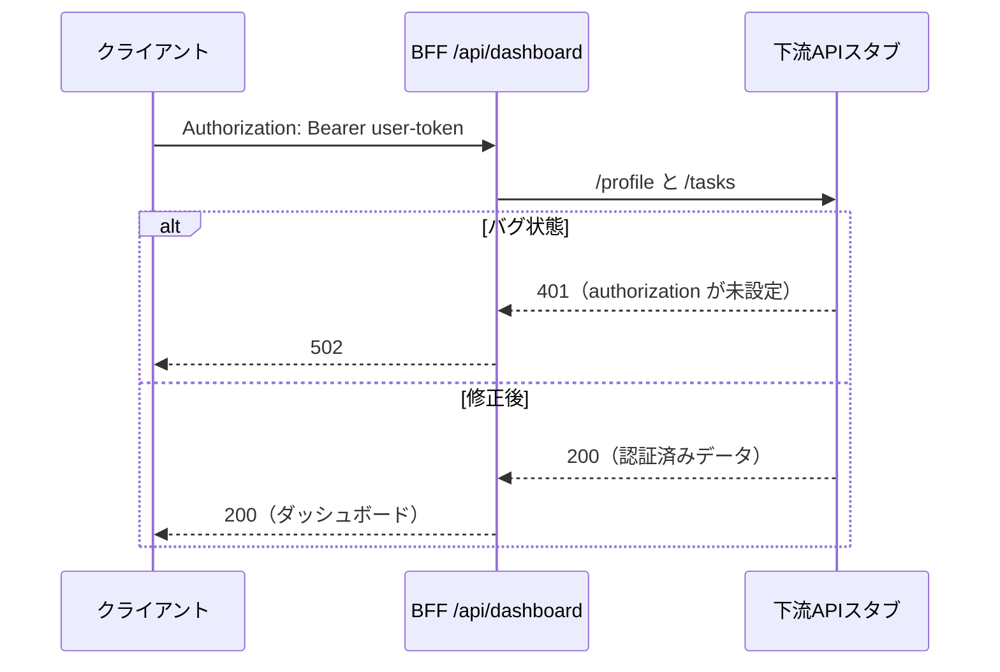

# BFF認証ヘッダー転送バグ・デバッグ演習

このリポジトリは、BFF（Backend for Frontend）が受信した `Authorization` ヘッダーを下流APIへ転送できず、ログイン済みユーザーにもダッシュボードを返せなくなる不具合を、最小構成で再現・調査・修正する教材です。意図的なバグはコミット履歴に保持し、既定ブランチは修正済みの安全な状態にしています。

> **期待値**：認証済みリクエスト `GET /api/dashboard` は `200` とプロフィール・未完了タスク数を返し、下流APIも `Bearer user-token` を受信する。
>
> **実際（バグ状態）**：下流APIは `authorization=undefined` を記録して `401` を返し、BFFは `502` を返す。

| 項目 | 内容 |
| --- | --- |
| 対象境界 | Express製BFFから下流HTTP APIへのリクエスト |
| バグの原因 | Node.jsで小文字化される受信ヘッダーを、`request.headers.Authorization` と大文字混じりで参照していたこと |
| 再現テスト | Expressアプリ、実HTTP下流スタブ、Supertestを使う統合テスト |
| 修正 | `request.header("authorization")` で取得した値を、下流呼び出しの `authorization` ヘッダーとして明示転送 |
| 必要環境 | Node.js 22以上、npm |

## 構成



## 実行方法

依存関係をインストールして、修正済みの既定ブランチを検証します。

```bash
npm install
npm test
npm run typecheck
```

テストは、BFFの公開レスポンスだけではなく、下流スタブが受け取った `Authorization` 値を検証します。この二つを分けて確認することで、「BFFが200を返した」という中間的な事実と「認証情報が下流まで届いた」という契約を混同しません。

## バグ状態を再現する

バグ状態はコミット `b3c3e11` に保存されています。次のコマンドで切り替え、テストが意図どおり失敗することを確認してください。

```bash
git checkout b3c3e11
npm install
npm test
```

次の観測結果が得られます。

```text
[downstream-stub] GET /profile authorization=undefined
[downstream-stub] GET /tasks authorization=undefined
expected 502 to be 200
```

演習後は修正済みブランチへ戻します。

```bash
git switch main
npm test
```

## 調査の焦点

Node.jsのHTTPメッセージでは、受信ヘッダーのキーは小文字化されます。したがって、Node.jsの低レベルな受信ヘッダーオブジェクトを直接参照する場合は `headers.authorization` を使う必要があります。[1] この教材では、フレームワークの大文字・小文字を区別しないアクセサである `request.header("authorization")` を使い、取得値を下流の `fetch` 呼び出しへ明示的に引き継ぎます。

原因・仮説・修正範囲は [デバッグ記録](docs/debugging-record.md) にまとめています。

## 範囲外

この教材は、本物の認証プロバイダ、JWTの検証、トークン更新、権限設計を実装しません。`Bearer user-token` は完全にローカルな固定値であり、外部サービスや資格情報は使用しません。

## References

[1]: https://nodejs.org/api/http.html "Node.js HTTP documentation"
