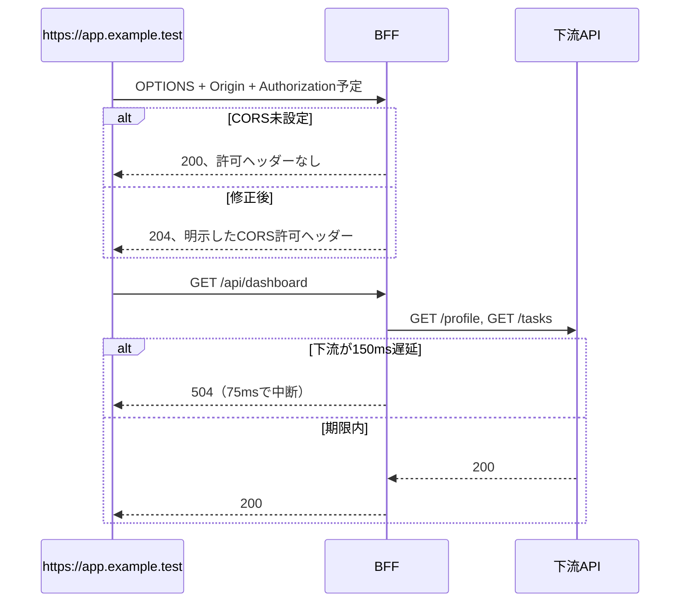

# デバッグ記録：CORSプリフライトと下流タイムアウトをBFFで明示的に扱う

## 結論

この演習では、BFFに二つの不備がありました。第一に、ブラウザが `Authorization` を伴うクロスオリジン要求の前に送る `OPTIONS` プリフライトに対して、BFFがCORS許可ヘッダーを返していませんでした。第二に、下流APIの `/tasks` が遅延しても、BFFが期限なく待機して `200` を返していました。

修正後は、許可済みOrigin `https://app.example.test` にだけ `Access-Control-Allow-Origin`、`Access-Control-Allow-Methods: GET, OPTIONS`、`Access-Control-Allow-Headers: Authorization` を返します。プリフライトでは `204` で終了し、許可外Originには許可ヘッダーを返しません。また、各下流呼び出しに75msの `AbortSignal.timeout()` を設定し、期限超過時に `504` を返します。[1] [2]

| 契約 | バグ状態 | 修正後 |
| --- | --- | --- |
| 許可済みOriginのプリフライト | `200`、CORS許可ヘッダーなし | `204`、Origin・GET・Authorizationを明示 |
| 許可外OriginのCORS許可 | 検証なし | 許可ヘッダーなし |
| 下流 `/tasks` の150ms遅延 | 約150ms待機後に `200` | 75ms超過後に `504` |
| 既存ダッシュボード契約 | 影響なし | `200`、プロフィールと未完了件数を返す |

## 再現条件

不具合を含むコミットは `f38b5d5`（`再現コードを追加する: CORSとタイムアウト不備`）です。下流APIはテスト内のローカルHTTPサーバーであり、外部接続は不要です。

```bash
git checkout f38b5d5
npm install
npm test
```

観測された失敗は次のとおりです。

```text
expected 200 to be 204
expected 200 to be 504
[downstream-stub] /tasks を 150ms 遅延させます
```

第一の失敗では、Expressの既定の `OPTIONS` 応答が `200` となったものの、ブラウザ向けのCORS許可情報がありません。第二の失敗では、下流スタブが150ms遅延してから成功応答を返し、BFFもそれを待って `200` を返しています。したがって、両方ともコンパイルやテスト設定の失敗ではなく、HTTP境界における期待契約との差分です。

## 調査



CORSでは、`Authorization` ヘッダーがプリフライトを必要とする要因になります。プリフライトは `OPTIONS` として送信され、サーバーは許可するOrigin、メソッド、リクエストヘッダーを応答で示します。[1] とくに `Authorization` は `Access-Control-Allow-Headers` に明示する必要があります。[2]

タイムアウトについては、Node.jsの `AbortSignal.timeout(delay)` が、指定ミリ秒後に中断される新しいシグナルを返します。[3] 本演習では、各`fetch`に独立したシグナルを渡し、どちらかが75ms以内に応答しない場合に `TimeoutError` を `504` へ変換します。これは「下流が後から成功した」というログと、「クライアントが期限内にBFFの結果を得た」という契約を分けて扱うためです。

| 仮説 | 証拠 | 判断 |
| --- | --- | --- |
| フロントエンドのOriginが誤っている | テストは許可済みOriginを固定で送る | 除外 |
| 下流APIが認証を拒否している | 下流スタブは二つの要求で `Bearer user-token` を観測する | 除外 |
| BFFにCORSミドルウェアがない | バグ状態のプリフライトは `200`、許可ヘッダーなし | 採用 |
| BFFに下流期限がない | 150ms遅延後にBFFは `200` を返す | 採用 |

## 最小修正

CORSの処理は、許可済みOriginに限定したミドルウェアとして追加します。許可外Originに対してワイルドカードや反射的なOrigin返却は行いません。

```ts
if (origin === allowedFrontendOrigin) {
  response.setHeader("Access-Control-Allow-Origin", allowedFrontendOrigin);
  response.setHeader("Access-Control-Allow-Methods", "GET, OPTIONS");
  response.setHeader("Access-Control-Allow-Headers", "Authorization");
  response.setHeader("Vary", "Origin");
}
```

下流呼び出しでは、応答期限を明示します。

```ts
fetch(`${downstreamBaseUrl}/tasks`, {
  headers: authHeaders,
  signal: AbortSignal.timeout(75)
});
```

例外処理では `TimeoutError` だけを `504` に変換し、接続失敗やその他の予期しないエラーは既存どおり `502` に分類します。

## 回帰確認

修正済みブランチへ戻して、全テストと型チェックを実行します。

```bash
git switch exercise/cors-timeout-debugging
npm test
npm run typecheck
```

回帰テストは四つの結果を独立して確認します。許可済みOriginのプリフライト、許可外Originに許可ヘッダーを付けないこと、下流遅延時の `504`、および既存ダッシュボードの `200` です。これにより、CORSを緩めすぎず、タイムアウトを単に待機時間の短縮として扱わず、既存の認証ヘッダー転送契約を維持します。

## 範囲と限界

75msはテストを高速かつ決定的にするための教材上の値であり、本番サービスの推奨値ではありません。本番では、下流のレイテンシ特性、全体のリクエスト期限、リトライ、サーキットブレーカー、利用者に返すエラー契約を基に設定します。また、本演習はCookieを使う認証や資格情報付きCORSを扱いません。これらを追加する場合、許可Originを明示し、資格情報とワイルドカードを併用しないことを別途検証する必要があります。[1]

## References

[1]: https://developer.mozilla.org/en-US/docs/Web/HTTP/Guides/CORS "MDN: Cross-Origin Resource Sharing (CORS)"
[2]: https://developer.mozilla.org/en-US/docs/Web/HTTP/Reference/Headers/Access-Control-Allow-Headers "MDN: Access-Control-Allow-Headers"
[3]: https://nodejs.org/api/globals.html "Node.js global objects"
