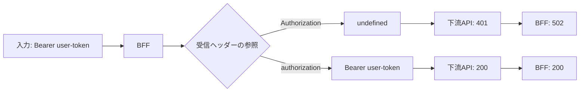

# デバッグ記録：BFFが認証済みリクエストを下流APIへ伝えられない

## 結論

BFFはクライアントから `Authorization: Bearer user-token` を受信していましたが、下流APIへのヘッダーを組み立てる際に `request.headers.Authorization` を参照していました。Node.jsの受信ヘッダーオブジェクトのキーは小文字化されるため、この値は `undefined` でした。[1] `request.header("authorization")` で取得した値を下流呼び出しへ `authorization` として渡すことで、同じ統合テストが成功します。

| 項目 | バグ状態 | 修正後 |
| --- | --- | --- |
| BFFへの入力 | `Authorization: Bearer user-token` | 同じ |
| 下流スタブの観測 | `authorization=undefined` | `authorization=Bearer user-token` |
| 下流APIの応答 | `401` | `200` |
| BFFの応答 | `502` | `200` |
| 最終レスポンス | ダッシュボード未返却 | `{ "displayName": "山田花子", "openTaskCount": 2 }` |

## 再現条件

バグを含むコミットは `b3c3e11`（`再現コードを追加する: BFFの認証ヘッダー転送不備`）です。ローカルスタブ以外のネットワーク接続は不要です。

```bash
git checkout b3c3e11
npm install
npm test
```

実行時の重要な観測ログは次のとおりです。

```text
[downstream-stub] GET /profile authorization=undefined
[downstream-stub] GET /tasks authorization=undefined
expected 502 to be 200
```

失敗はコンパイルエラーや設定ミスではありません。BFFの実HTTP呼び出しが下流スタブに届き、スタブが認証情報の欠如を理由に `401` を返した結果、BFFが `502` を返しています。

## 調査

テストは以下の順で事実を検証します。まず、既知の認証ヘッダーを持つリクエストをBFFの `GET /api/dashboard` へ送ります。次に、BFFの応答ステータスとJSON本文を検証します。最後に、下流スタブが実際に受信した二つの `Authorization` 値を配列として検証します。



次の仮説を比較しました。

| 仮説 | 検証結果 | 判断 |
| --- | --- | --- |
| クライアントが認証ヘッダーを送っていない | Supertestで `Authorization` を設定している。修正後のBFFログも認証情報の受信を示す。 | 除外 |
| 下流APIの認証仕様が誤っている | 同じ固定トークンを正しく転送すると、両エンドポイントは `200` を返す。 | 除外 |
| BFFが受信値を誤って参照している | バグ状態のコードは `headers.Authorization` を参照し、下流ログは `undefined` を示す。 | 採用 |

HTTPヘッダー名自体は大文字・小文字を区別しませんが、Node.jsが提供する受信ヘッダーオブジェクトのキーは小文字です。[1] したがって、プロトコルの性質とランタイム内のオブジェクト表現は区別して扱う必要があります。

## 最小修正

修正後は、BFFで次のように値を一度だけ取得して共有します。

```ts
const authorization = request.header("authorization");
const authHeaders: Record<string, string> = authorization ? { authorization } : {};

await fetch(`${downstreamBaseUrl}/profile`, { headers: authHeaders });
await fetch(`${downstreamBaseUrl}/tasks`, { headers: authHeaders });
```

この変更は、認証の新設やトークン値の加工ではなく、既に受信した認証情報を二つの下流APIへ正しく引き継ぐことだけを目的としています。値そのものはログへ出力せず、BFFでは有無だけを記録します。

## 回帰確認

修正済みの `main` ブランチで次を実行します。

```bash
git switch main
npm test
npm run typecheck
```

統合テストは、BFFが `200` と所定のJSONを返すことに加え、下流スタブが二回とも `Bearer user-token` を受信したことを確認します。これにより、例外が消えただけではなく、外部境界を越えた最終的な契約が回復したことを保証します。

## 範囲と限界

本演習は、HTTPヘッダーの参照・転送に限定します。複数の認証方式、トークンの再発行、タイムアウト、リトライ、実際のIDプロバイダとの連携は対象外です。これらを追加する場合も、BFFの応答だけでなく、下流へのリクエストと下流の応答を独立して観測するテスト境界を保つ必要があります。

## References

[1]: https://nodejs.org/api/http.html "Node.js HTTP documentation"
